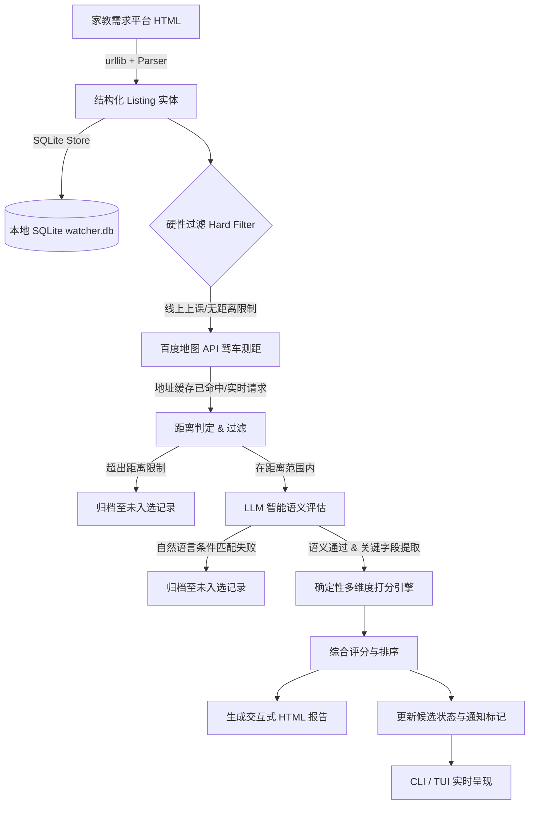

# zjjjzx-watcher

[](https://www.python.org/)
[](https://opensource.org/licenses/MIT)
[](https://textual.textualize.io/)
[](https://rich.readthedocs.io/)

> **智能家教需求抓取 · 百度地图驾车测距 · LLM 语义匹配与评分终端 (CLI & TUI)**

[English Documentation](README_EN.md)

---

## 🌟 项目亮点

`zjjjzx-watcher` 专为家教老师与大学生家教设计，能够自动追踪家教服务平台的最新发布单，通过高德/百度地图 API 精准测算上门驾车距离，并借助大语言模型（DeepSeek / 兼容 OpenAI 格式）对复杂的自然语言需求进行深度语义研判，最终在终端（CLI / TUI）及自适应 HTML 报告中呈现高匹配度候选。

- ⚡ **自动抓取与增量存储**：内置 HTML 解析器与 SQLite 存储引擎，增量去重，避免重复打扰。
- 🗺️ **百度地图高精测距**：根据设定的出行起点，批量地理编码并计算实际驾车距离，自带本地地址经纬度与距离缓存。
- 🤖 **LLM 智能语义筛选**：支持使用自然语言定义个人偏好（如“接受小学至高一数学培优，不接受初中竞赛，英语限非毕业班”），大模型自动解析年级段、时薪换算、总收益预估及排班时间。
- 🖥️ **沉浸式 TUI 交互控制台**：基于 `Textual` 构建现代终端仪表盘，支持候选看板、未入选分析、异步流水线执行、实时日志流与热键操作。
- 💻 **全功能 Rich CLI 工具集**：提供 `run`、`candidates`、`rejected`、`history`、`stats`、`config`、`report` 等子命令。
- 📊 **响应式 HTML 报告导出**：单文件自包含 HTML 报表，卡片化呈现各项核心指标与原始抓取全文。

---

## 🏗️ 架构概览



---

## 🚀 快速上手

### 1. 克隆与安装依赖

```bash
git clone https://github.com/your-username/zjjjzx-watcher.git
cd zjjjzx-watcher

# 安装依赖 (也可通过 pip install -e . 安装为系统命令)
pip install -r requirements.txt
# 或者直接安装核心依赖
pip install rich textual
```

### 2. 配置环境变量

复制 `.env.example` 为 `.env`，填入百度地图 AK 与 LLM API 密钥：

```bash
cp .env.example .env
```

`.env` 内容示例：

```ini
# 百度地图开放平台 AK（服务端类型，需开通地理编码与驾车算路权限）
BAIDU_MAP_AK=your_baidu_maps_ak_here

# DeepSeek API Key（用于自然语言需求匹配）
DEEPSEEK_API_KEY=your_deepseek_api_key_here

# 可选：自定义 OpenAI 兼容 Base URL
# DEEPSEEK_BASE_URL=https://api.deepseek.com
```

### 3. 配置个人偏好

复制 `config.example.json` 为 `config.json`：

```bash
cp config.example.json config.json
```

编辑 `config.json`，根据你的实际情况设定区域、出发起点与自然语言条件：

```json
{
  "source": {
    "url": "https://zjjjzx.com/?city=%E5%AE%81%E6%B3%A2%E5%B8%82",
    "city": "宁波市"
  },
  "profile": {
    "areas": ["鄞州区"],
    "subjects": ["数学", "英语"],
    "max_distance_meters": 10000,
    "allow_online": false,
    "conditions": "可接受小学至高一数学；小学奥数可接受，但初中竞赛不接；英语四级通过非专业水平；地点驾车距离不超过10公里。"
  },
  "maps": {
    "origin": "宁波市鄞州区万达广场"
  }
}
```

---

## 🖥️ TUI 交互式终端使用指南

执行以下命令即可启动全新的交互式 TUI 界面：

```bash
python main.py tui
# 或通过 CLI 命令：
zjjjzx tui
```

### 界面模块
1. **匹配候选 (Candidates)**：左侧为候选列表表格，右侧实时显示选中候选的高亮卡片，包含时薪、距离、LLM 推荐理由、原始全文，并支持一键在浏览器打开详情页或标记已联系。
2. **未入选记录 (Rejected)**：查看被硬过滤（如距离超出）或 LLM 否决的条目及详细原因。
3. **任务控制与日志 (Runner)**：可视化抓取控制面板，支持勾选试运行、跳过 LLM、忽略时间窗口，并实时展示执行流日志。
4. **历史与统计 (Stats & History)**：统计总抓取量、候选数、缓存命中率，并展示历史每次运行指标。
5. **偏好配置 (Config)**：查看当前生效的环境变量与条件。

### 快捷键
- <kbd>r</kbd>：立即开始抓取与匹配
- <kbd>o</kbd>：在浏览器中打开 HTML 报告
- <kbd>f</kbd>：刷新界面数据
- <kbd>q</kbd>：退出 TUI

---

## 💻 CLI 命令行使用指南

本项目提供完善的命令行工具：

```bash
# 1. 执行抓取与匹配流水线
python main.py run

# 常用选项：
python main.py run --dry-run             # 试运行（不标记条目为已通知）
python main.py run --no-llm              # 跳过大模型，仅执行规则过滤与测距
python main.py run --force               # 强制忽略时间窗口限制（默认 09:00-21:00）
python main.py run --open-report         # 执行完成后自动用浏览器弹出 HTML 报告
python main.py run --loop --interval 2   # 持续轮询模式，每 2 小时执行一次

# 2. 查询当前库内匹配候选
python main.py candidates
python main.py candidates -n 10          # 限制条数

# 3. 查询未通过筛选的条目
python main.py rejected

# 4. 查看数据库统计与测距缓存状态
python main.py stats

# 5. 查看历史运行记录
python main.py history

# 6. 校验当前配置与 API Key 就绪状态
python main.py config

# 7. 打开 HTML 报告
python main.py report -o
```

---

## 📂 项目结构

```text
zjjjzx-watcher/
├── zjjjzx/                     # 核心 Python 包
│   ├── __init__.py             # 版本及对外统一导出
│   ├── cli.py                  # Rich 驱动的命令行界面
│   ├── tui.py                  # Textual 驱动的交互终端界面
│   ├── config.py               # 配置读取、验证与 Profile 模型
│   └── core/
│       ├── engine.py           # 核心流水线调度引擎
│       ├── fetcher.py          # 网络页面抓取 (重试与 UA 伪装)
│       ├── parser.py           # 页面数据解析 (HTMLParser)
│       ├── filters.py          # 硬过滤规则与评分排序算法
│       ├── baidu_maps.py       # 百度地图 API 地理编码与驾车算路
│       ├── llm_client.py       # DeepSeek / LLM 语义判断客户端
│       ├── store.py            # SQLite 数据存储与缓存操作
│       └── report.py           # 现代化自适应 HTML 报告生成
├── tests/                      # 自动化测试用例
│   ├── test_core.py            # 核心解析、过滤、存储与报表单元测试
│   └── test_cli.py             # 配置校验与扩展存储查询测试
├── scripts/                    # 历史与辅助脚本
│   ├── run_once.py             # 一次性快速抓取测试脚本
│   └── legacy_main.py          # 原始单文件启动入口留档
├── main.py                     # 统一根入口 (支持 CLI/TUI/向后兼容)
├── pyproject.toml              # 标准 Python 项目打包配置
├── config.example.json         # 示例配置文件 (已脱敏)
├── .env.example                # 环境变量配置模板
├── LICENSE                     # MIT 开源许可证
└── README.md                   # 中文文档
```

---

## 🧪 运行测试

使用 Python 自带的 `unittest` 即可运行全部测试套件：

```bash
python -m unittest discover -s tests
```

---

## 🤝 贡献与参与

欢迎提交 Issue 和 Pull Request！
1. Fork 本项目
2. 创建特性分支：`git checkout -b feature/amazing-feature`
3. 提交修改：`git commit -m 'Add amazing feature'`
4. 推送分支：`git push origin feature/amazing-feature`
5. 发起 Pull Request

---

## 📄 开源许可证

本项目基于 [MIT License](LICENSE) 开源。
